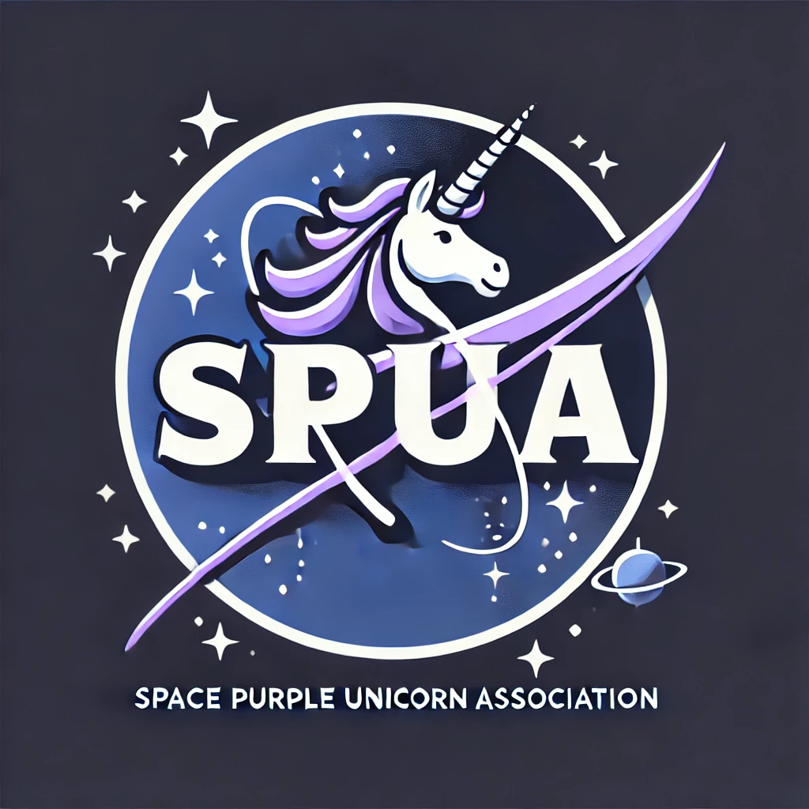

```
     .-'''-. .-------.   ___    _     _______      .-'''-. ,---.  ,---..-./`)
    / _     \\  _(`)_ \.'   |  | |   /   __  \    / _     \|   /  |   |\ .-.')
   (`' )/`--'| (_ o._)||   .'  | |  | ,_/  \__)  (`' )/`--'|  |   |  .'/ `-' \
  (_ o _).   |  (_,_) /.'  '_  | |,-./  )       (_ o _).   |  | _ |  |  `-'`"`
   (_,_). '. |   '-.-' '   ( \.-.|\  '_ '`)      (_,_). '. |  _( )_  |  .---.
  .---.  \  :|   |     ' (`. _` /| > (_)  )  __ .---.  \  :\ (_ o._) /  |   |
  \    `-'  ||   |     | (_ (_) _)(  .  .-'_/  )\    `-'  | \ (_,_) /   |   |
   \       / /   )      \ /  . \ / `-'`-'     /  \       /   \     /    |   |
    `-...-'  `---'       ``-'`-''    `._____.'    `-...-'     `---`     '---'

        ::::    Space Purple Unicorn Counter - Super Visualizer   ::::
```

# Welcome to the SPUC Super Visualizer!

This image provides a web interface to track unicorn sightings over time.
Its delicious purple color scheme will make you feel like you are in a magical world!

What's more, it simplifies the process of registering space purple unicorn sightings.
Simply fill and submit the form and continue your search for these fantastic creatures!

## Running the service

This image is intended to be used in conjunction with the Space Purple Unicorn Counter (SPUC)
[image](https://hub.docker.com/r/spuacv/spuc).

Set the `SPUC_HOST` environment variable to the address of the SPUC service.

The port **8322** is exposed to access the web interface.

A standard run command would look like this:
```
docker run -p 8322:8322 -e SPUC_HOST=http://spuc:8321 spuacv/spucsvi:latest
```

However, we highly recommend using Docker Compose to manage the services in conjunction.

## Brought to you by:

{alt='SPUA Logo.'}
