In this episode, we will take a tour of the Docker Desktop dashboard, as is a helpful and graphical way of understanding the key concepts of Docker.

If you have installed Docker on a Windows or Mac machine, you will have Docker Desktop installed (Linux users generally **wont** have Docker Desktop).

Although useful as an introduction, it is unlikely that you will use Docker Desktop on your day to day work.
You are much more likely to use the command line interface to interact with Docker, and we will cover this shortly.

It is also important to note that while Docker Desktop is mostly free, some features are offered at a premium.
Additionally, it is not fully functional on all operating systems; it can produce conflicts with the docker engine on Linux, for example.

Therefore, **this episode is meant to be demonstrative, that is, you do not *need* to follow along**.

::::::::::::::::::::::::::::::::::::::: objectives
- Show Docker Desktop and its components.
- Understand what images and containers are.
- Visualize the process of image aquisition, container execution and where it ends.
- Understand the ephimeral nature of containers.
- Have a glimpse at containers that allow interaction.
- Understand the importance of cleaning up in docker.
- Understand the limitations of Docker Desktop.
::::::::::::::::::::::::::::::::::::::::::::::::::


:::::::::::::::::::::::::::::::::::::::: questions
- What is Docker Desktop?
- What can it be used for?
- Why can't it replace the cli?
::::::::::::::::::::::::::::::::::::::::::::::::::


The *Space Purple Unicorn Association* (SPUA) has instructed us to get to work on a very important mission, counting the number of purple unicorns in the universe!

They have told us to find the *Space Purple Unicorn Counter* (SPUC) container image in preparation for our mission.

## Getting images

One of the useful features of Docker Desktop is the ability to search and analyze container images.

If you open the application you will likely see something like this:

{alt='Docker Desktop being opened for the first time.'}

You'll notice that the panel on the left has a tab for 'Images' and another for 'Containers'.
These will be the focus for the episode, and we will ignore most other features.

On the top blue bar you'll also find a search icon, which allows us to search for container images.

Lets go ahead and select this search box, and search for `spuacv/spuc`.

{alt='Search window.'}

You may have noticed that it already shows some information about the image.
If you click on the image you'll be shown more information.
You should be able to see the documentation, and it lets you select a tag (version) from the dropdown menu.

{alt='Search and select a tag.'}

Once you find the image you were looking for, you can either download it (pull), or directly run it.

We'll start by downloading the latest version.
Go ahead and click on the `Pull` button.

Lets also pull the `hello-world` and `alpine` images, which will help us explore features and issues with Docker Desktop.


## Inspecting images

Lets now go to the `Images` tab on the left panel.
This shows a list of all the images in your system, so you will be able to see `spuc` and the other two images here.

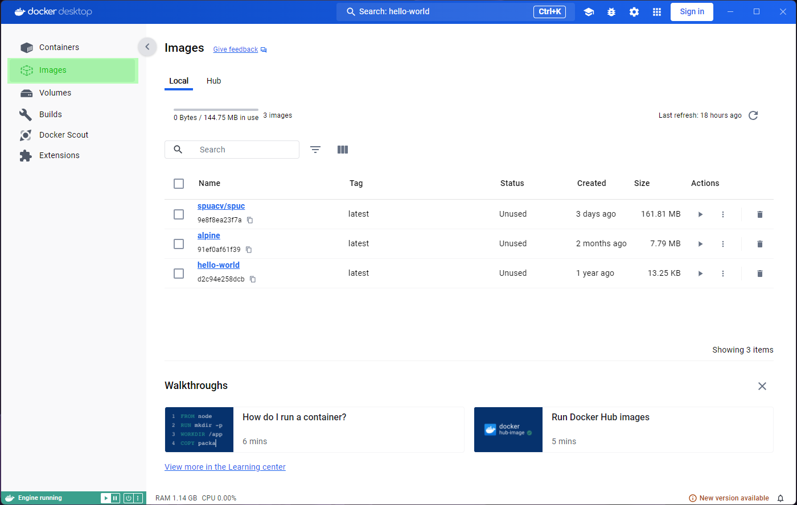{alt='Images list showing spuc, alpine and hello-world.'}

The list already shows some information about the images, like their tag, size, and when they were created.
It is also the place where you can run the images, or delete them.
However, before we go any further, we want to **inspect** the images.

Clicking on the image will open a window with information on how the image is built, and examine its packages and vulnerabilities.
If any of the building blocks of the image are vulnerable, we can see which, and where they come from (Image hierarchy).
For example, the vulnerabilities in the `spuc` image come from its base image, `python3-slim".

{alt='Inspecting spuc image.'}

This all looks rather scary, and it is important that we are careful with the images that we download.
It is therefore quite useful to be able to analize them like this.
The `python:3-slim` image, in particular, comes from a verified publisher, so it is unlikely to be malicious.

Another interesting thing to look at is the last few lines, which usually show the command that will be run when the container is started.


## Running containers

The images that we just downloaded are immutable snapshots of an environment, distributed to be used as *templates* to create `containers`.
Containers are executions of the image, and because they are running, they become mutable.

Let's run the `hello-world` image by clicking the `Run` button in the `Actions` column, from the `Images` tab.

{alt='Run button from Images tab.'}

A prompt will ask you to confirm `Run` or modify some optional settings.
For now, lets just confirm with `Run`.

{alt='Run confirmation prompt.'}

You will be taken to a `Logs` tab inside the container that you just ran.
The logs show the output of this particular image, "Hello from Docker!" among other things.

If you look carefully, the `Containers` tab on the left is highlighted.
We are looking at a container now, not an image, and so we were re-located.

You might also find the heading in this page strange.
Unless you specify a name for the container (which we could have done in the optional settings),
Docker will generate a random name for it, which is what we see here.

Exploring the `Inspect` tab will show us some information, but for now we are more interested in what the `Terminal` and `Stats` tabs have to say.
They both seem to indicate that we need to *run* or *start* the container.

::: tab

### Logs

{alt='Logs tab in container from hello-world image.'}

### Inspect

{alt='Inspect tab in container from hello-world image.'}

### Bind mounts

{alt='Bind mounts tab in container from hello-world image.'}

### Exec

{alt='Exec tab in container from hello-world image.'}

### Files

{alt='Files tab in container from hello-world image.'}

### Stats

{alt='Stats tab in container from hello-world image.'}

:::


Indeed, if we look carefully, we will find an 'Exited (0)' status under the container name, and a `Start` button near the top-right corner.
However, if we click on that button we will see the output duplicated in the logs, and the `Exited (0)` status again.

{alt='Clickling Start on the already run hello-world container.'}

If we go back to the images tab and run the image again, we'll see that the same thing hapens.
We get the "Hello from Docker!", and the container (with a new random name) exits.

{alt='Running hello-world image for a second time.'}

The nature of most containers is *ephimeral*.

They are meant to execute a process, and when the process is completed, they exit.
We can confirm this by clicking on the `Containers` tab on the left.
This will exit the container inspection and show us all the containers.

We have only run the `hello-world` image, but you can see there are two containers.
Both containers in the list have a status 'Exited'.

{alt='Containers list.'}

You may be wondering why there are two containers, and not just one, given that we only used one image.
As mentioned before, the *image* is used as a template, and as many *containers* as we want can be created from it.
Every time we run the image, a new container is created.

So why are there not three containers then?
When we ran the image from the container inspection window, we were running the command on the same container.
That's why there's only two, even though we saw the container in action three times.

If we go back to the `Images` tab and run `hello world` again, we'll see a new container appear.
All the containers are still there, and they are not deleted automatically.
This can actually become problematic, and we will deal with it in a bit.

## Interacting with containers

Not all containers are as short lived as the ones from the `hello-world` image.
Lets try running the `spuacv/spuc`, but look at the optional settings this time.
If you remember, we were instructed to run the container and configure a port.
Lets add a map to the port `8321` in the local machine.

{alt='Optional settings for spuc.'}

We are now ready to run it.
You can immediately notice the status under the container name is `Running`,
and instead of an option to start the container, we now get the option to stop it.
The `Logs` tab is not too different, but the `Stats` tab already shows more information.
The `Exec` tab also looks more interesting, we get access to a terminal inside the running container.

::: tab

### Logs

{alt='Logs tab in container from spuc image.'}

### Inspect

{alt='Inspect tab in container from spuc image.'}

### Bind mounts

{alt='Bind mounts tab in container from spuc image.'}

### Exec

{alt='Exec tab in container from spuc image.'}

### Files

{alt='Files tab in container from spuc image.'}

### Stats

{alt='Stats tab in container from spuc image.'}

:::

Before trying to do anything in the terminal, let`s look at the container list by clicking on the `Containers` tab on the left.
You'll see the green icon of the container indicating that it is still live, and indication of how long it's been running for.

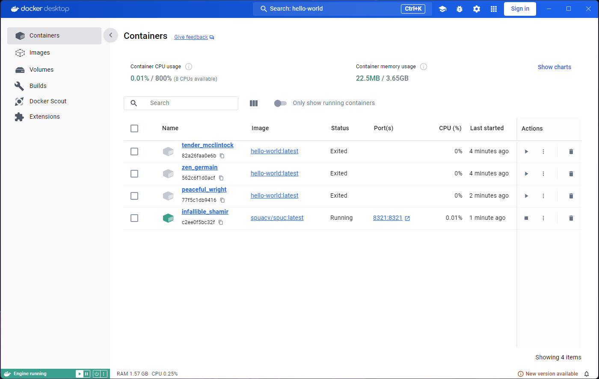{alt='Containers list, spuc still running.'}

Clicking on the container name again will take us back to the `Logs` tab in the container.

:::::::::::::::::::::::::::: callout

### Spot a unicorn!

If you look at the logs, you'll see that the SPUC container is instructing you on how to interact with it.
Lets go ahead and try that.
Open a terminal and run the command `curl -X PUT localhost:8321/unicorn_spotted?location=moon\&brightness=100`.
If you look at the logs again, you'll see that the container has responded to your command with something like:

```
{"message":"Unicorn sighting recorded!","location":"moon","brightness":100}
```

The documentation also mentioned that you can configure this print by modifying the `print.config` file.
How do we do that?

::::::::::::::::::::::::::::::::::::

Let's try and interact with the terminal inside the container.

If you print the working directory with `pwd` you'll get the app's base directory: `/spuc`.
You can also list the contents with `ls`, and look at the app's code.
We can even run `apt update` and install something; for example `apt install nano`.

{alt='Interacting with spuc terminal in the Exec tab.'}

As you might expect, We can also modify things, like for example the `print.config` file.
Since we have installed nano, lets use it to edit the file.
Run `nano config/print.config` and you'll see the contents of the file.
Replace the the print config line with:

```
::::: {time} Unicorn number {count} spotted at {location}!! Brightness: {brightness} {units}
```

Another curl now should show the changes we made to the `print.config` file.

At this point, it seems like the container is very much like a virtual machine, and we can do whatever we want with it. 
However, as we've mentioned before, containers are *meant to be ephimeral*.

If we stop the container, we get a familiar empty tab in `Exec` and `Stats`.
The `Containers` tab on the left will also show the container status as `Exited`.

Lets go back to the `Images` tab, and run the `spuc` image again.
Now lets go to the `Exec` tab, and try and edit the `print.config` file again.
You'll notice that `nano` is not there anymore.
If you look at the contents of the file, for example with `cat config/print.config`, you'll see that the changes we made are gone.

{alt='Exec in fresh spuc container.'}

When we re-ran the *image*, we created a **new** *container*.
The new container is created from the template saved in the image, and so our changes have banished.
This becomes very clear when we go back to the `Containers` tab on the left.
We can see that the first container we created from the `spuc` image is there,
next to the new container (which is still running, by the way).

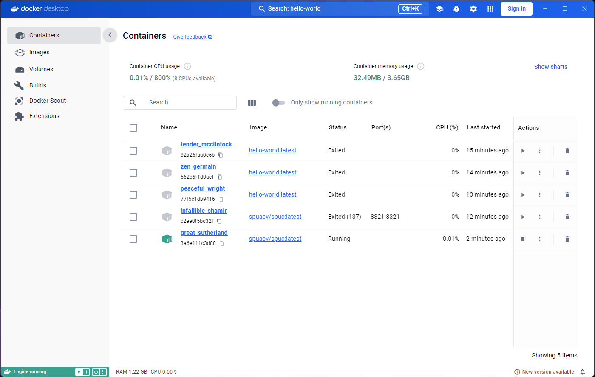{alt='Containers list after new run of spuc image.'}


## Reviving containers

We *can* get the old container running again, although this is rarely something we'd *want* to do.
In Docker Desktop, all we need to do is click on the `Start` button from the `Containers` list.
The terminal will appear empty, because it is a new session, but you will be able to see the changes we made before.
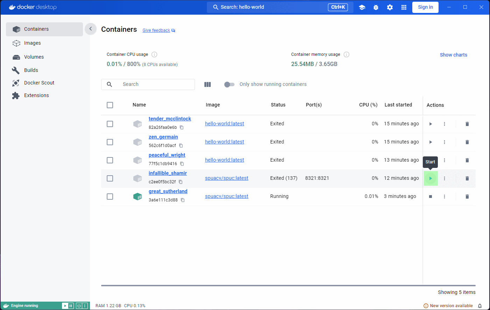{alt='Reviving container spuc.'}


## Naming containers

We've been a bit sloppy with the containers, and they all have random names.
It is possible to name the containers when we run them, and this can be very useful.
However, it can also cause us problems.

Lets run the `spuc` image again, and name the container `SPUC`.

{alt='Optional settings for spuc.'}

If we look at the container list, it is much easier to find it, so the name is useful!

However, we forgot to map the port.
So lets stop this container, and launch another one.
This time we'll map the port, and use the name we wanted.
{alt='Optional settings for spuc.'}

This time we got an error! This is because the name `SPUC` is already "in use" by another container.
If we want the same name, we'll have to delete the old container first.


## Cleaning up

Lets go to the containers list, and delete the `SPUC` container.
There is a very convenient bin icon on the right, which will prompt you for confirmation.

{alt='Deleting container SPUC.'}

You should now be able to run the `spuc` image again, and name the container `SPUC`.

Since we are deleting stuff, the `hello-world` image was nice and useful to test docker was working, but it is now rather useless.
If I want to delete it, the `Images` tab on the left has a convenient bin icon to do so.
Clicking on it will prompt you for confirmation, but it will fail.

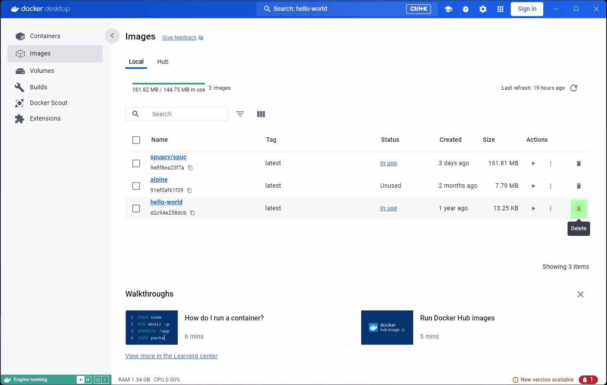{alt='Failing to delete image.'}

You'll probably notice that the status of the image is `In use`.
That seems strange though, given that all the containers from that image excited immediately.

Lets have a look at the `Containers` tab.
Some of the containers in the list came from the `hello-world` image.
They are now stopped, but the fact that they originated from the `hello-world` image is enough.

We've only been using Docker for very little, and we already have a long list of containers!
You may see how this can become a problem;
Particularly so because we were a bit sloppy and did not name the containers.

Let's try and get rid of the containers then.
We can conveniently select them all with the tickbox at the top, and an option to `Delete` shows up.
Clicking on it will prompt for confirmation, and we can go ahead and accept.
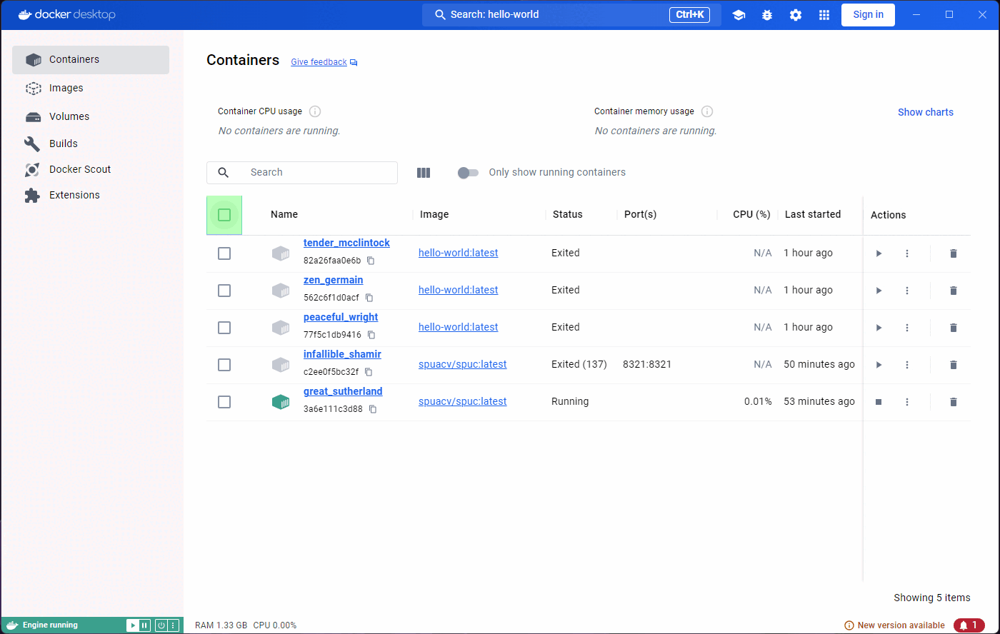{alt='Deleting containers.'}

All our containers are now gone. Forever. We can't get them back.
This is fine though - they were meant to be ephimeral.

***Warning:*** You have to be careful here, this action deleted even the containers that were running.
You can filter the containers before you select them "all".

On the up-side, the `Images` tab shows the `hello-world` image as `Unused` now.
For docker, an image is `In use` as long as at least one container has been created from it.
Since we have no containers from that image, Docker now knows the images can be safely deleted.
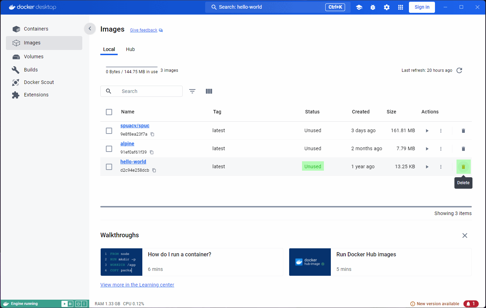{alt='Successfully deleting images.'}


## Limitations - Why not Docker Desktop?

We have seen many of the neat and functional bits of Docker Desktop, and it can be mighty appealing,
particularly so if you lean towards the use of graphical interfaces.
However, we've not touched on its weaknesses.

One thing we have completely lost now is the record of our unicorn sightings.
The containers are gone, and so are the changes we made to the `print.config` file.
Data in the containers can be made persistent, but it is not the default behaviour,
and it is not something you can do from Docker Desktop!

Another very important thing is that Docker Desktop is very limited in *how* you can run the containers.
The optional settings let you modify the instruction with which the container is run, but it is very limited.

For example, let's run the other image we have already pulled, `alpine`,
which is the image of a very lightweight Linux distribution.
Go to the images list, and click on run.

Nothing seems to have happened at all!
Not even a single output to the `Logs`, and no way to open a terminal inside Alpine.

::: tab

### Logs

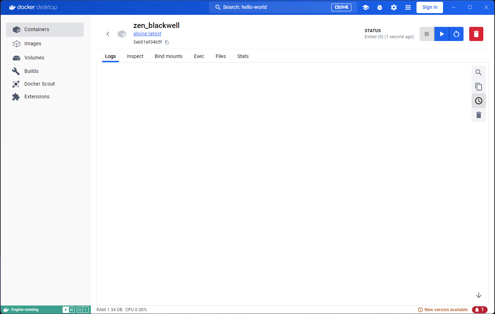{alt='Logs tab in container from alpine image.'}

### Inspect

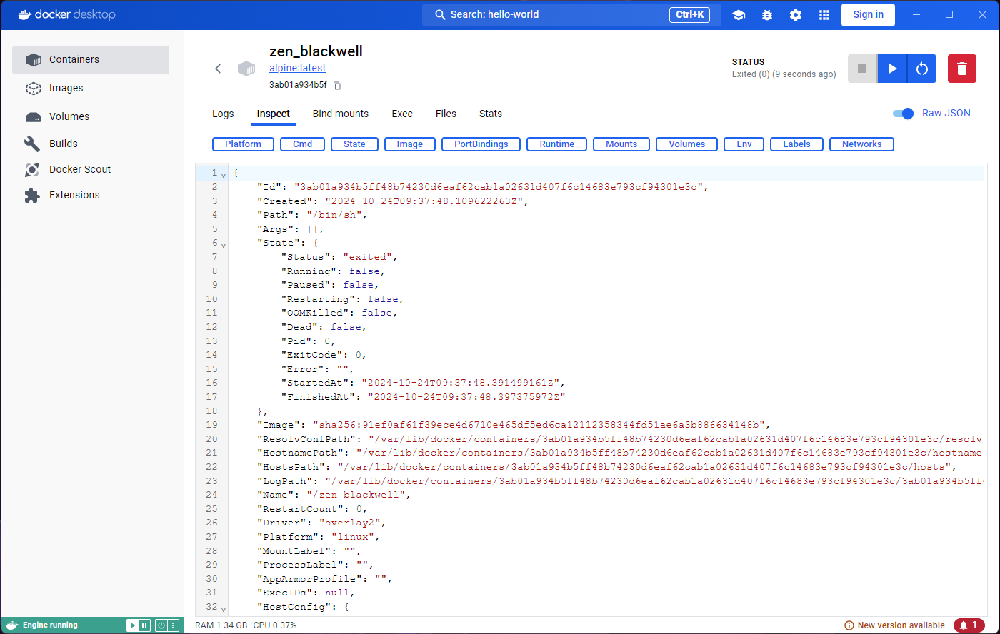{alt='Inspect tab in container from alpine image.'}

### Bind mounts

{alt='Bind mounts tab in container from alpine image.'}

### Exec

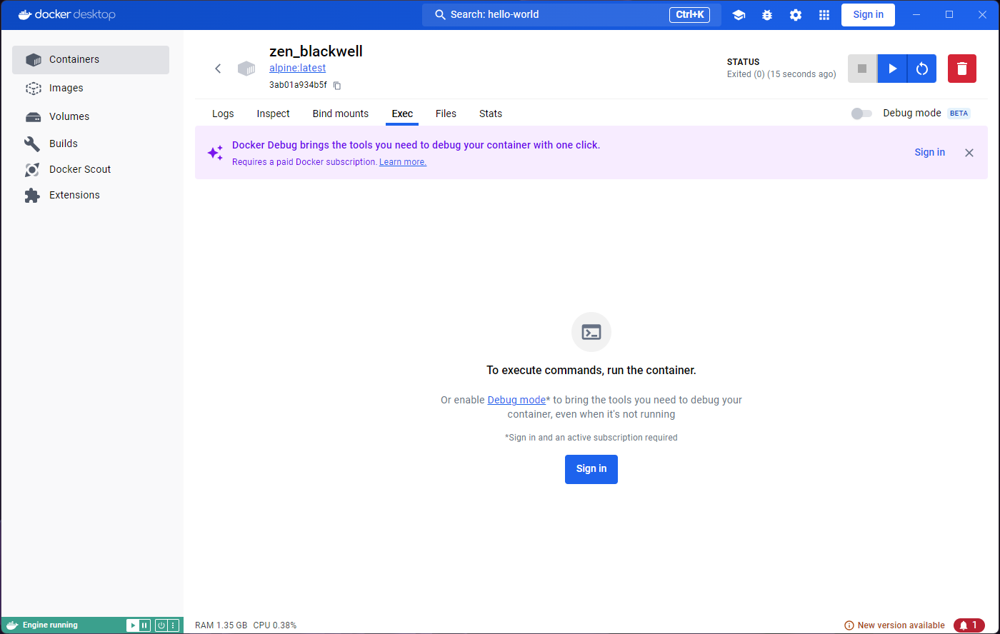{alt='Exec tab in container from alpine image.'}

### Files

{alt='Files tab in container from alpine image.'}

### Stats

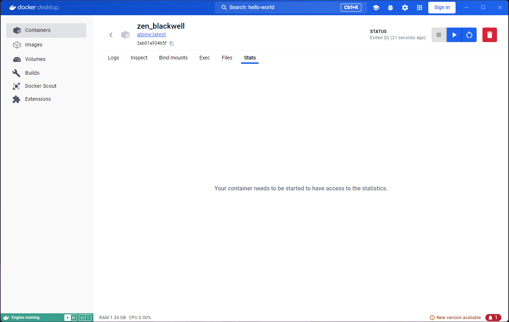{alt='Stats tab in container from alpine image.'}

:::

Just to be clear though, this Docker image does contain the whole Alpine OS.
In Docker Desktop, however, there is no way to interact with it.
This is the case for many (if not most) images.
To be able to use it (or them), we need to provide some sort of input or command,
which we cannot provide from Docker Desktop.

Therefore, Docker Desktop cannot really be used for much more than being a nice dashboard.

In the next episode, we will use docker from the command line, and all of the advantages it brings will become aparent.


:::::::::::::::::::::::::::::::::::::::: keypoints
- **Images** are snapshots of an environment, easily distributable and ready to be used as ***templates*** for containers.
- **Containers** are ***executions of the images***, often with configuration added on top, and usually ***meant for single use***.
- Running a container usually implies creating a new copy, so it is important to **clean up regularly**.
- **Docker Desktop** is a great ***dashboard*** that allows us to understand and visualize the lifecycle of images and containers.
  It could potentially be all you need to use if you only *consume* images out of the box.
  However, it is ***very limited*** in most cases (even for *consumers*),
  and rarely allows the user to configure and interact with the containers adequately.
::::::::::::::::::::::::::::::::::::::::::::::::::
