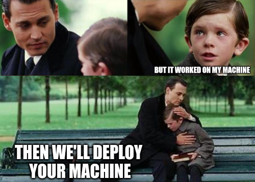

# **Introduction to Docker**

The adventures of Docker and the
Space Purple Unicorn Association

uomresearchit.github.io/docker-introduction/

---

## The plan

* Day 1
    - Introduction
    - Docker Desktop
    - Building our Docker CLI toolkit
    - --- Break ---
    - Sharing information with containers
    - --- Lunch Break ---
    - The Docker Hub
    - Configuring containers

* Day 2
  - Creating your own container images
  - --- Break ---
  - Using Docker Compose
  - --- Lunch Break ---
  - Conclusion

---

* ## Why containers?
  * Reliable Software
  * Microservices

* ## Why Docker?

  * Most popular/mature
  * Easy to convert from docker to others

---

### The Space Purple Unicorn Association

The Space Purple Unicorn Association is a community effort to count the number of purple unicorns in space.

We are a friendly group of developers, data scientists, and unicorn enthusiasts, who are passionate about surveying and conserving the purple unicorn population.

We're delighted to have you join us! To support the community's efforts, 
we've created a set of tools and resources that will both help count purple unicorns and introduce you to fundamental Docker concepts.

Over this course, you'll run your own Space Purple Unicorn Counting service, 
and encourage your local community to join in the count!

---

### Start helping now!

We will use the <i>Space Purple Unicorn Counter</i> (<strong>SPUC</strong>) container image for our service,
which can found on Docker Hub.

This image provides an API, which can be hit to add an event to the sightings record.

To register a sighting, we'll send a PUT request to the API,
with the unicorn's location and brightness.

Before we start counting unicorns, we'll need to complete a few setup steps.
Let's get started!

